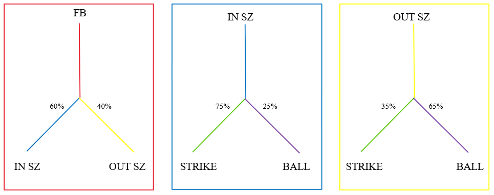
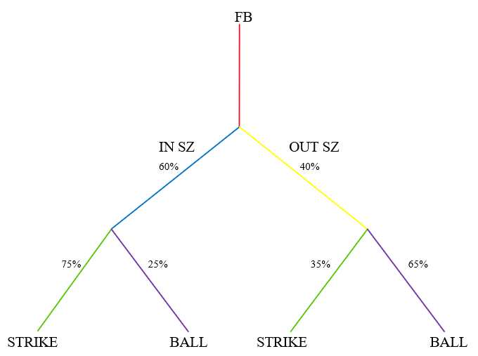

\
\
\

### **Problem 1**
Assume that in every inning a starting pitcher pitches he’s projected to give up 0 runs 60% of the time and 1 run 40% of the time. Assume similarly that a relief pitcher is projected to give up 0 runs 70% of the time and 1 run 30% of the time. Assume the starting pitcher will throw 165 innings and the relief pitcher will throw 50 innings in a season. What are the odds that the starting pitcher gives up less runs on a per-inning basis than the relief pitcher?
\
\
**The probability of the starting pitcher outperforming the relief pitcher on a per-inning basis is **
**about 9.29%. The odds are therefore about 0.102/1.** 

```{r echo=TRUE}
#The probability of an event occurring k times over n trials is
#a randomly distributed binomial variable. We simulate this
# using rbinom() over a million iterations to estimate the 
#proportion of average successes over 165 or 50 innings given 
#the respective pitcher.

#starting pitcher simulation
sp <- rbinom(n = 1000000, size = 165, prob = 0.4) 
sp <- sp / 165

#relief pitcher simulation

rp <- rbinom(n = 1000000, size = 50, prob = 0.3)
rp <- rp / 50

#The results are taken and then logically evaluated 
#in order to create a probability that the starting pitcher 
#outperforms the relief pitcher.

#result

result <- sp < rp
num <- (sum(result, na.rm = TRUE))/1000000

odds <- num/(1-num)

```
 
\
\
\

### **Problem 2**
A pitcher throws 60% of his fastballs in the strike zone. Given that a pitch is in the strike zone, the home plate umpire is known to call a strike 75% of the time, and given a pitch out of the strike zone he is known to call a ball 65% of the time. A fastball from this pitcher in a game with the umpire behind the plate is called a ball. What is the probability that that pitch was in the strike zone?
\
\
We are given 3 conditional probabilities. Their complements are easily determined and so we have: 
\
\

$$P(IN SZ | FB) = 0.6 \implies P(OUTSZ|FB) = 0.4$$

$$P(STRIKE|INSZ)=0.75 \implies P(BALL|INSZ) = 0.25$$

$$P(STRIKE|OUTSZ)=0.35 \implies P(BALL|OUTSZ) = 0.0.65$$
\
\
In order to visualize these conditional probabilities, we can construct the decision trees below:
\
\

\
\
Furthermore, we can connect the three decision trees as shown below by connecting the leaves of the first tree to the roots of the others:
\
\

\
\
The question is answered by calculating the following probability:
\
\
$$P(INSZ|FB\cap BALL)$$
\
\
We do this by calculating the proportion of events "INSZ" that are included within both "FB" and "BALL" out of the total amount of events that include both "FB" and "BALL." This gives us:
$$P(INSZ|FB\cap BALL) = \frac{0.25\cdot0.6}{(0.25\cdot0.6)+(0.65\cdot0.4)}\approx .3658 $$

### **Problem 3**
A linear regression model with a normal error term is fit to predict ERA as a function of K% (strikeouts per plate appearance) and BB% (walks per plate appearance) for pitchers. The estimated coefficients on the linear model are as follows:
\
Intercept: 5.81 
\
Slope on K%: -11.7 
\
Slope on BB%: 11.4 
\
Residual standard error/standard deviation of error on estimates: 1.31 

a) What is the probability that a pitcher with a K% of 0.20 and a BB% of 0.10 outperforms a pitcher with a K% of 0.25 and a BB% of 0.20 under this model?
\
\
**Under this model, the pitcher with K% = 0.2 and BB% = 0.1 will outperform the pitcher with K% = 0.25 and BB% =** **0.20 approximately 66.41% of the time.**
\
\


```{r}
#Predicted ERA values for each pitcher based on model
Pitcher1_ERA <- 5.81 - (11.7 * 0.2) + (11.4 * 0.1) # = 4.61
Pitcher2_ERA <- 5.81 - (11.7 * 0.25) + (11.4 * 0.2) # = 5.165

#What is the probability that pitcher 1's ERA is lower than
#pitcher 2's ERA under this model?

prob <- pnorm(5.165, mean = 4.61, sd = 1.31)
```

\
\

b) If Hit by Pitches per PA were to be added to this model, would you expect the coefficient on BB% to be greater or lower in magnitude? Why? 
\
\
**I would expect the coefficient for BB% to decrease if Hit By Pitches per PA were added**
**since BB% is very likely directly correlated to ERA as well as the fact that HBP/PA**
**is a subset of BB%. This would split the effect that BB% has on ERA into BB% and HBP/PA, and** 
**therefore decreasing the value of the coefficient on BB% in exchange for the added coefficient on HBP/PA.** 
\
\


c) On the same data set, a logistic regression model is fit with the dependent variable being 1 if ERA is less than 4.00 and 0 if ERA is greater than 4.00. The estimated coefficients on the logistic regression model are as follows: Intercept: -2.18 K%: 15.9 BB%: -16.1 Is the marginal effect of K% on the probability of having an ERA < 4.00 larger for someone with a K% of 0.20 and BB% of 0.10 or a pitcher with a K% of 0.25 and BB% of 0.20?
\
\
**The marginal effect of K% on the probability of a pitcher's ERA being less than 4.00**
**is greater for the pitcher with K% = 0.2 and BB% = 0.1. This implies that the first**
**pitcher's ERA would benefit more from increasing his K% than the second pitcher based**
**on this model.**
\
\
```{r}
# Create a function for the partial derivative wrt K% given a 
#logistic regression model
# and the given coefficients
fun <- deriv(expression((exp(-2.18+(15.9*x1)-16.1*x2))/(1+exp(-2.18+(15.9*x1)-16.1*x2))), c("x1", "x2"), function.arg = TRUE)

#Evaluate marginal effect of K% on P(ERA < 4.00) for each 
#pitcher
fun(0.2, 0.1) # = 3.62
fun(0.25, 0.2) # = 2.48
```
\
\


d) If forced to choose between these linear or logistic models based on K% and BB%, which would
you prefer to use to determine the quality of a pitcher from only their K% and BB%? Why?
\
\
**I would prefer the linear model as a general-purpose tool in determining the quality of a pitcher. Although** **classifying pitchers into different categories can be useful, I don't think separating pitchers into 2** 
**categories is generally helpful. For example in this problem, pitchers are classified by the model** **projecting the probability of an ERA lesser or greater than 4. This exercise could be helpful in filtering out potential** **candidates, but there is also a significant difference in production from a 4.00 ERA pitcher and a** 
**2.00 or even a 3.00 ERA pitcher over the course of a season. **
\

### **Problem 4**
Entering the day of September 26, 2022 the New York Mets had a record of 97-57 and the Atlanta
Braves were 95-58. In their remaining games, the Mets and Braves were set to play each other in a
3-game series, plus each had 2 other series against other opponents. To that point in the season
the Mets’ record against the Braves was 9-7, and if the two teams tied in overall record at the end
of the season, whichever team won the season series against each other would win the division.
Assume that the Mets’ odds of winning each of their remaining games was 50%. Assume that the
Braves’ odds of winning each game against the Mets was 50% and p against all non-Mets
opponents. For what value of p would give the Braves a 50% chance of winning the division?

```{r message=FALSE}
library(tidyverse)

# This function (taking in p as an argument) simulates the 
#last three series for the Mets and Braves. 
# This simulation assumes that the braves have 9 games left and #the mets have 8 games left. The probability of the braves #winning the division is simulated using randomly distributed #binomial variables defined by the values above and evaluated #logically as "braves_win_div" given each case that is 
#possible. The results are summed up and averaged over 
#1 million iterations and returned as a percentage.

braves_mets_sim <- function(p){
  braves_mets <- rbinom(1000000, 3, 0.5)
  mets_braves <- 3 - braves_mets

  braves_other <- rbinom(1000000, 6, p)
  mets_other <- rbinom(1000000, 5, 0.5)

  braves_total <- braves_mets + braves_other + 95
  mets_total <- mets_other + mets_braves + 97

  braves_win_div <- (braves_total > mets_total) | ((braves_total == mets_total) & braves_mets == 3)

  return(sum(braves_win_div, na.rm = TRUE) / 1000000)
}

#An initial range of values for p is defined to pass into the 
#simulation through the map_dbl() function. This narrows down 
#the range that would result in a win % of 0.5.
range1 <- seq(0.5, 0.85, by = 0.05)

range2 <- seq(0.8, 0.84, by = 0.001)

values <- map_dbl(.x = range2, .f = ~braves_mets_sim(.x))


# The Projected Probability of Winning the division over the 
# range of values for P is plotted and an estimated answer is 
# approximated by the graph results. Lines are added to show
# a visualization of this approximation

plot(range2, values, xlab = "Values for p", ylab = "Projected Chance of Winning Division")
abline(h=0.5,col="blue")
abline( v=0.8285, col = "red")
```
\
\
As shown above, an appropriate value for p would be approximately **p = 0.8285**. 
\
\
\

### **Problem 5**
Assume that a newly drafted player has WAR/S projections (WAR/S defined as Wins Above
Replacement per Season, where the scale of a Season is defined as 600 Plate Appearances) in each
of his first 12 professional seasons distributed according to a normal distribution with mean and
standard deviation parameters provided below.
Assume that in each season his expected MLB-level playing time is a calculated as a function of his
projection, weighted by the probability of the given projection according to the stated probability
distribution. For a given WAR/S projection, p, the playing time function is:

$$
PlayingTime (PA) = \left\{\begin{aligned}
&0 &&    p < 0\\
&600*(p/2) && 0 < p \le 2\\
&600 && p > 2
\end{aligned}
\right.$$

What is this player’s total expected MLB-level playing time over the 7-year period where the
projected cumulative playing time is at a maximum?
\
\


```{r include=FALSE}
library(knitr)
library(kableExtra)
```
 
```{r echo=FALSE}
season <- c(1:12)
WAR_per_S <- c(-2.6, -1.5, -0.5, 0.2, 0.8, 1.4, 1.5, 1.4, 1.2, 0.9, 0.5, -0.1)
sd <- c(0.2, 0.7, 1.0, 1.3, 1.5, 1.7, 1.9, 2.1, 2.3, 2.4, 2.6, 2.8)
df <- data.frame(season, WAR_per_S, sd)
kable(df, col.names = c("Season", "Mean WAR/S Projection","StandardDeviation"), align = c("c", "c", "c")) %>%
  kable_styling(bootstrap_options = "bordered")

```
\
\
The expected cumulative playing time is estimated to be about **264 Plate Attempts**.

```{r}
library(tidyverse)

# Given that the probability of a specific outcome over a 
# continuous distribution is always 0,
# the decision was made to calculate the probability of the 
# value being between the projected 
# value +/- 0.05 as WAR is usually reported to one decimal 
# place and 0.05 would facilitate rounding 
# up or down. An initial data frame is created and additional 
# columns are added for the probability 
# as well as unweighted and weighted playing time predictions.


#Calculating P(WAR-0.05 < X < WAR+0.05)
df <- df %>% mutate(prob = pnorm(WAR_per_S+0.5, mean = WAR_per_S, sd = sd)-pnorm(WAR_per_S-0.05, mean = WAR_per_S, sd = sd)) 

playing_time <- function(p){
  if(p < 0){
    return(0)
  }else if(p>0 & p<=2){
    return(600*(p/2))
  }else{
    return(600)
  }
}

df <- df %>% 
  rowwise() %>%
  mutate(PA_unweighted = playing_time(WAR_per_S))

df <- df %>%
  mutate(PA_weighted = PA_unweighted * prob)
View(df)

#Looking at the data frame we can see that the projected
# maximum accumulated playing time occurs during 
# seasons 5 through 11

answer <- sum(df$PA_weighted) # = 264.0842 PA
```

\
\
\

### **Problem 6**
Given the following information, describe how you would construct a model to predict the likelihood of a flyball out on a flyball to the outfield:
Identities of all players on field (fielders, pitcher, batter, runners), game state (number of outs, runners on base, inning, score), temperature, crowd size, batted ball launch characteristics (exit velocity, launch angle, spray angle, hang time), outfielder fielding percentage, stadium characteristics (fence distance and height), day/night game, pitcher/batter historical matchup results, initial fielder positioning data.
Note: There is no need to find data and generate an actual model. Please just describe how you would proceed assuming you had the data listed. Please limit your response to 300 words.
\
\
**For this model I would start by choosing data that may affect the chance of a flyball being caught** 
**in the outfield. This would include: Identities of all players (specifically outfielders), temperature, crowd size, batted ball launch characteristics, outfielder** 
**fielding percentages, stadium characteristics, day/night game, and initial fielder positioning data.**
**Next, I would start by developing a multiple logistic regression model calculating the probability **
**that the flyball in the outfield is caught. Depending on the data that is used in creating the model,** 
**I would try to validate the model given another data set to test the accuracy of the model over a** **significant number of data points. Analysis of this validation procedure would likely show weaknesses **
**in the model, and so the model would need to be updated with either additional statistics or ** 
**a change in the existing model such as ignoring values that don't have a significant effect on the **
**outcome. **


\
\
\

### **Problem 7**
The Brewers are considering signing one of two different infielders to 4-year guaranteed contracts with WAR/S projections and salaries in the following table:
```{r echo=FALSE}
Season <- c(2023,2023, 2024, 2024, 2025, 2025, 2026, 2026)
Player <- c("Player A", "Player B", "Player A", "Player B", "Player A", "Player B", "Player A", "Player B")
WAR_s <- c(1.1, 3.1, 1.7, 2.4, 1.5, 1.6, 1.2, 0.7)
Salary <- c(1.0, 10.0, 3.0, 10.0, 7.0, 10.0, 10.0, 10.0)
df <- data.frame(Season, Player, WAR_s, Salary)
dfA <- df %>% filter(Player == "Player A") %>%
  select(-Player)
knitr::kable(dfA, caption = "Player A", col.names = c("Season", "WAR/S","Salary ($M)"), align = c("c", "c", "c")) %>%
  kable_styling(bootstrap_options = "bordered")
dfB <- df %>% filter(Player == "Player B") %>%
  select(-Player)
knitr::kable(dfB, caption = "Player B", col.names = c("Season", "WAR/S","Salary ($M)"), align = c("c", "c", "c")) %>%
  kable_styling(bootstrap_options = "bordered")
```

Assuming you had to pick one of these two deals, which player would you recommend the Brewers sign. Note: there are no forfeited draft picks or any other compensation required for the contracts. Please explain your process and any assumptions you make. Please limit your answer to 300 words.
\
\
**Given the Brewers' goals over the next 4 years and the projections of how the current team would align** 
**with these goals in mind would affect my answer. Also given both Players A and B, it seems likely that Player B would** 
**be a veteran major league player given the projected decline in WAR/S over the contract length and that** **Player A is relatively young since they are projected to remain stable over the 4 year contract and so this is also assumed. Over** 
**the 4 years, Player A is projected to accumulate 5.5 WAR for \$21M and Player B is projected to** 
**accumulate 7.8 WAR for \$40M. Therefore Player A is worth about 0.26 WAR per million dollars spent** 
**and Player B is worth just under 0.2 WAR per million dollars spent. Suppose the Brewers goal is to **
**win more as soon as possible in order to make a push at winning the division or making a wild card run, **
**and that both Players A and B would be a significant upgrade at their given position. Player B would more likely be worth the investment as the projected additional 2 WAR above** **Player A over the first season would align more with the organizational goals and would probably be more likely in pushing the **
**team over the threshold in a tight race. Now suppose the division is more competitive, and although** **winning is always the end goal, the organization is more focused on developing talent over the next** 
**couple of years. This would be an indicator that Player A's contract could be more beneficial in the **
**long run if saving money while remaining relatively competitive at their position is the goal.  **


\
\
\

### **Problem 8**
In 2022, two minor leagues used an automated ball-strike (ABS) challenge system, in which the umpire calls balls and strikes, but the pitcher, catcher, and batter may challenge the call. Each team is allocated three challenges per game with successful challenges retained. If this system were to be implemented in the majors in 2024, how should teams adjust their team building and gameplay strategies to prepare? Please limit your answer to 300 words.
\
\
**If this system were to be implemented, it would be beneficial to extract value from the changes by** 
**maximizing the number of challenges that overturn calls for the team issuing the challenge, and also**
**by minimizing the calls overturned by opposing teams issuing challenges. Given this objective, data** **gathering over the 2023 season could be crucial in hitting the ground running for the 2024 season. This**
**could take shape on one side by gathering data throughout games where players signal that they would have** **challenged a specific call, and going into 2024, the analysis of this data would likely imply which **
**players in the organization have the highest likelihood of overturning a challenged call, and in turn** **retaining the challenge. On the other hand, analysis of a batter's ability to take balls and swing at** **strikes close to the edge of the strike zone (chase-rate) would help in minimizing the number of** 
**challenges overturned in favor of the opposing team. Similarly, analyzing a pitcher's deceptiveness** 
**given off-speed movement or pitch-trajectory could influence a batter's ability to challenge** 
**balls/strikes and should be leveraged accordingly. Additionally, game states should come into play when** **analyzing challenges as retaining challenges for high-leverage situations will likely be key to a team's** **success.** 
